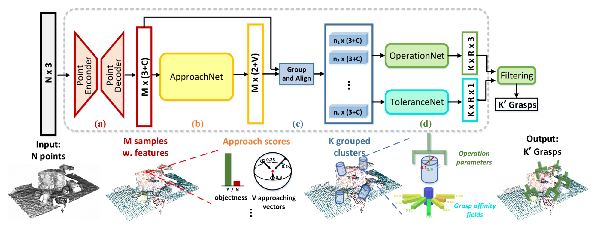

# Franka 6-DoF Grasping with GraspNet

This repository demonstrates **6-DoF grasping on the Franka FR3** using [GraspNet](https://github.com/graspnet/graspnet-baseline). It integrates modern PyTorch, stereo depth estimation, and lightweight robot control for reproducible and extensible research.

## Key Features

* **Easy to use**: Pure Python implementation, no ROS required. Robot control via [franky](https://github.com/TimSchneider42/franky).
* **Modern PyTorch**: Upgraded to PyTorch 2.6.0 with CUDA 12.4.
  * Includes a modified [knn-cuda](https://github.com/lif314/knn_pytorch_cuda) adapted for CUDA 12.x.
* **Stereo depth estimation**: Uses D435i IR stereo + [FoundationStereo](https://github.com/NVlabs/FoundationStereo) for better depth quality compared to RGB-D.
* **Multiple demos**: Built on top of [GraspNet-Baseline](https://github.com/graspnet/graspnet-baseline), with major modifications in `franka_graspnet/` and `scripts/`.

---

## Tested Environment

* **OS**: Ubuntu 22.04
* **CUDA**: 12.4
* **Python**: 3.12
* **Torch**: 2.6.0
* **Camera**: Intel RealSense D435i
* **Franky**: [franky](https://github.com/TimSchneider42/franky) (libfranka 0.15.0)

---

## Installation

### Create environment

```bash
conda create -n graspnet python==3.12
conda activate graspnet

pip install torch==2.6.0 torchvision==0.21.0 --index-url https://download.pytorch.org/whl/cu124
pip install -r requirements.txt
pip install setuptools==78.0.1

# libfranka 0.15
pip install franky-control
pip install pyrealsense2

# install graspnet dependencies
cd pointnet2
python setup.py install
cd ..

cd knn
python setup.py install
cd ..

cd graspnetAPI
pip install .
cd ..

# (Optional) install FoundationStereo dependencies
pip install -r requirements_fs.txt
```

### Download checkpoints
- [FoundationStereo](https://github.com/NVlabs/FoundationStereo?tab=readme-ov-file#model-weights) 
- [GraspNet](https://github.com/graspnet/graspnet-baseline?tab=readme-ov-file#training-and-testing)

Organize checkpoints as follows: 

```
checkpoints/
├── foundation_stereo
│   ├── 11-33-40
│   │   ├── cfg.yaml
│   │   └── model_best_bp2.pth
│   └── 23-51-11
│       ├── cfg.yaml
│       └── model_best_bp2.pth
└── graspnet
    ├── checkpoint-kn.tar
    └── checkpoint-rs.tar
```

---

## Usage

> **Note**: We adopt an **eye-in-hand** setup. You can modify the calibration parameters in [franka\_controller](./franka_graspnet/franka_controller.py) to adapt them to your own system.


### Test GraspNet

```bash
python scripts/graspnet_demo.py
```


### Test FoundationStereo

```bash
python scripts/fs_demo.py
```


### RealSense + GraspNet (6-DoF grasp prediction, press `q` to fetch next frame)

```bash
python scripts/graspnet_rs_demo.py
```

<p align="left">
  <a href="">
    
  </a>
</p>

### RealSense + FoundationStereo (stereo depth estimation, press `space` to refresh, `q` to quit)

```bash
python scripts/fs_rs_demo.py
```

<p align="left">
  <a href="">
    
  </a>
</p>


### RealSense + FoundationStereo + GraspNet (6-DoF grasp prediction, press `q` to fetch next frame)

```bash
python scripts/graspnet_fs_rs_demo.py
```

<p align="left">
  <a href="">
    
  </a>
</p>

### Franka + RealSense RGB-D + GraspNet (real-time grasping)

```bash
python scripts/franky_graspnet_rs_demo.py
```

<p align="left">
  <a href="">
    
  </a>
</p>


### Franka + RealSense IR + FoundationStereo + GraspNet (real-time grasping)

```bash
python scripts/franky_graspnet_fs_demo.py
```

<p align="left">
  <a href="">
    
  </a>
</p>


## Known [Issues](https://github.com/TimSchneider42/franky/issues/57)

When controlling FR3 with **franky**, motion may sometimes abort with reflex errors such as:

```
franky._franky.ControlException: libfranka: Move command aborted: motion aborted by reflex! ["joint_velocity_violation"]

franky._franky.ControlException: libfranka: Move command aborted: motion aborted by reflex! ["cartesian_reflex"]
```

Currently, the best set of control parameters is unclear. Trajectory planners (e.g., [curobo](https://github.com/NVlabs/curobo)) might help.
Contributions, suggestions, and parameter tuning advice are highly welcome! 🚀


------------------------------
# GraspNet Baseline
Baseline model for "GraspNet-1Billion: A Large-Scale Benchmark for General Object Grasping" (CVPR 2020).

[[paper](https://openaccess.thecvf.com/content_CVPR_2020/papers/Fang_GraspNet-1Billion_A_Large-Scale_Benchmark_for_General_Object_Grasping_CVPR_2020_paper.pdf)]
[[dataset](https://graspnet.net/)]
[[API](https://github.com/graspnet/graspnetAPI)]
[[doc](https://graspnetapi.readthedocs.io/en/latest/index.html)]

<div align="center">    
    
    
    
    <br> Top 50 grasps detected by our baseline model.
</div>



## Requirements
- Python 3
- PyTorch 1.6
- Open3d >=0.8
- TensorBoard 2.3
- NumPy
- SciPy
- Pillow
- tqdm

## Installation
Get the code.
```bash
git clone https://github.com/graspnet/graspnet-baseline.git
cd graspnet-baseline
```
Install packages via Pip.
```bash
pip install -r requirements.txt
```
Compile and install pointnet2 operators (code adapted from [votenet](https://github.com/facebookresearch/votenet)).
```bash
cd pointnet2
python setup.py install
```
Compile and install knn operator (code adapted from [pytorch_knn_cuda](https://github.com/chrischoy/pytorch_knn_cuda)).
```bash
cd knn
python setup.py install
```
Install graspnetAPI for evaluation.
```bash
git clone https://github.com/graspnet/graspnetAPI.git
cd graspnetAPI
pip install .
```

## Tolerance Label Generation
Tolerance labels are not included in the original dataset, and need additional generation. Make sure you have downloaded the orginal dataset from [GraspNet](https://graspnet.net/). The generation code is in [dataset/generate_tolerance_label.py](dataset/generate_tolerance_label.py). You can simply generate tolerance label by running the script: (`--dataset_root` and `--num_workers` should be specified according to your settings)
```bash
cd dataset
sh command_generate_tolerance_label.sh
```

Or you can download the tolerance labels from [Google Drive](https://drive.google.com/file/d/1DcjGGhZIJsxd61719N0iWA7L6vNEK0ci/view?usp=sharing)/[Baidu Pan](https://pan.baidu.com/s/1HN29P-csHavJF-R_wec6SQ) and run:
```bash
mv tolerance.tar dataset/
cd dataset
tar -xvf tolerance.tar
```

## Training and Testing
Training examples are shown in [command_train.sh](command_train.sh). `--dataset_root`, `--camera` and `--log_dir` should be specified according to your settings. You can use TensorBoard to visualize training process.

Testing examples are shown in [command_test.sh](command_test.sh), which contains inference and result evaluation. `--dataset_root`, `--camera`, `--checkpoint_path` and `--dump_dir` should be specified according to your settings. Set `--collision_thresh` to -1 for fast inference.

The pretrained weights can be downloaded from:

- `checkpoint-rs.tar`
[[Google Drive](https://drive.google.com/file/d/1hd0G8LN6tRpi4742XOTEisbTXNZ-1jmk/view?usp=sharing)]
[[Baidu Pan](https://pan.baidu.com/s/1Eme60l39tTZrilF0I86R5A)]
- `checkpoint-kn.tar`
[[Google Drive](https://drive.google.com/file/d/1vK-d0yxwyJwXHYWOtH1bDMoe--uZ2oLX/view?usp=sharing)]
[[Baidu Pan](https://pan.baidu.com/s/1QpYzzyID-aG5CgHjPFNB9g)]

`checkpoint-rs.tar` and `checkpoint-kn.tar` are trained using RealSense data and Kinect data respectively.

## Demo
A demo program is provided for grasp detection and visualization using RGB-D images. You can refer to [command_demo.sh](command_demo.sh) to run the program. `--checkpoint_path` should be specified according to your settings (make sure you have downloaded the pretrained weights, we recommend the realsense model since it might transfer better). The output should be similar to the following example:

<div align="center">    
    
</div>

__Try your own data__ by modifying `get_and_process_data()` in [demo.py](demo.py). Refer to [doc/example_data/](doc/example_data/) for data preparation. RGB-D images and camera intrinsics are required for inference. `factor_depth` stands for the scale for depth value to be transformed into meters. You can also add a workspace mask for denser output.

## Results
Results "In repo" report the model performance with single-view collision detection as post-processing. In evaluation we set `--collision_thresh` to 0.01.

Evaluation results on RealSense camera:
|          |        | Seen             |                  |        | Similar          |                  |        | Novel            |                  | 
|:--------:|:------:|:----------------:|:----------------:|:------:|:----------------:|:----------------:|:------:|:----------------:|:----------------:|
|          | __AP__ | AP<sub>0.8</sub> | AP<sub>0.4</sub> | __AP__ | AP<sub>0.8</sub> | AP<sub>0.4</sub> | __AP__ | AP<sub>0.8</sub> | AP<sub>0.4</sub> |
| In paper | 27.56  | 33.43            | 16.95            | 26.11  | 34.18            | 14.23            | 10.55  | 11.25            | 3.98             |
| In repo  | 47.47  | 55.90            | 41.33            | 42.27  | 51.01            | 35.40            | 16.61  | 20.84            | 8.30             |

Evaluation results on Kinect camera:
|          |        | Seen             |                  |        | Similar          |                  |        | Novel            |                  | 
|:--------:|:------:|:----------------:|:----------------:|:------:|:----------------:|:----------------:|:------:|:----------------:|:----------------:|
|          | __AP__ | AP<sub>0.8</sub> | AP<sub>0.4</sub> | __AP__ | AP<sub>0.8</sub> | AP<sub>0.4</sub> | __AP__ | AP<sub>0.8</sub> | AP<sub>0.4</sub> |
| In paper | 29.88  | 36.19            | 19.31            | 27.84  | 33.19            | 16.62            | 11.51  | 12.92            | 3.56             |
| In repo  | 42.02  | 49.91            | 35.34            | 37.35  | 44.82            | 30.40            | 12.17  | 15.17            | 5.51             |

## Citation
Please cite our paper in your publications if it helps your research:
```
@article{fang2023robust,
  title={Robust grasping across diverse sensor qualities: The GraspNet-1Billion dataset},
  author={Fang, Hao-Shu and Gou, Minghao and Wang, Chenxi and Lu, Cewu},
  journal={The International Journal of Robotics Research},
  year={2023},
  publisher={SAGE Publications Sage UK: London, England}
}

@inproceedings{fang2020graspnet,
  title={GraspNet-1Billion: A Large-Scale Benchmark for General Object Grasping},
  author={Fang, Hao-Shu and Wang, Chenxi and Gou, Minghao and Lu, Cewu},
  booktitle={Proceedings of the IEEE/CVF Conference on Computer Vision and Pattern Recognition(CVPR)},
  pages={11444--11453},
  year={2020}
}
```

## License
All data, labels, code and models belong to the graspnet team, MVIG, SJTU and are freely available for free non-commercial use, and may be redistributed under these conditions. For commercial queries, please drop an email at fhaoshu at gmail_dot_com and cc lucewu at sjtu.edu.cn .